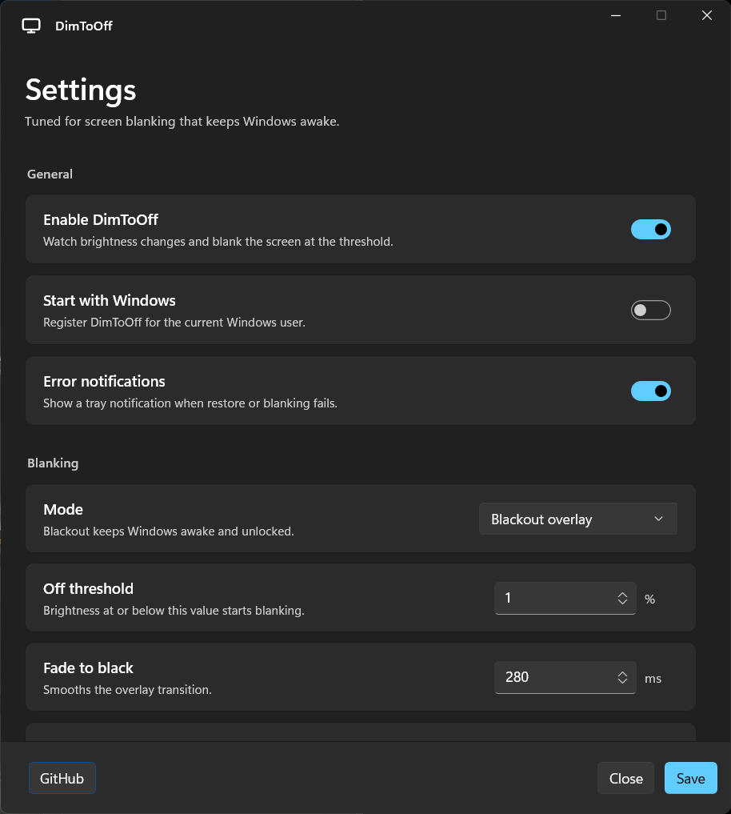
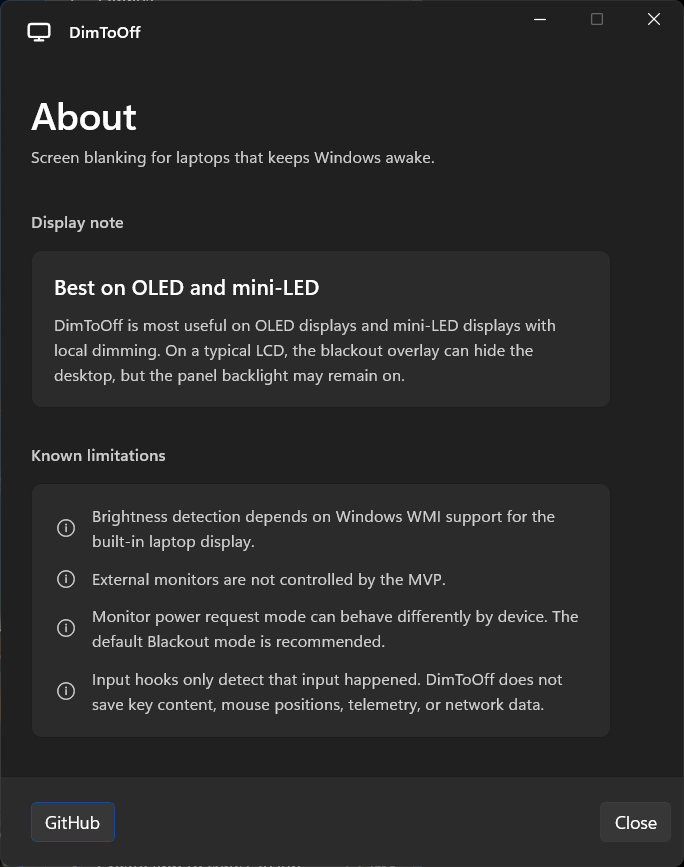
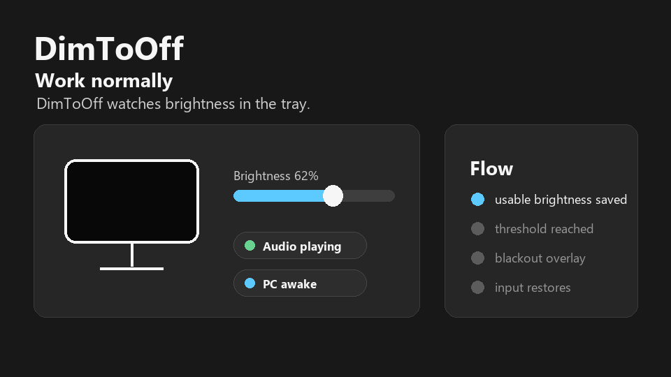

# DimToOff v0.4.0

DimToOff v0.4.0 focuses on making the app easier to try and safer to understand before release.

## Highlights

- Added an in-app About window with display-fit notes and known limitations.
- Added release-ready screenshots and a short demo GIF under `docs/release-assets/v0.4.0`.
- Generated Windows x64 ZIP packages and a per-user Inno Setup installer.
- Kept the verified blackout/restore behavior intact.
- Kept reserved settings such as `DisableWhileFullscreen` and `DisableWhenExternalMonitorConnected` hidden from the UI until they are fully implemented.

## Display Note

DimToOff is most useful on OLED and mini-LED displays. In the default Blackout mode, Windows stays awake and unlocked while a fullscreen black overlay hides the desktop.

On a typical LCD, the overlay can hide the screen contents, but the backlight may remain on, so the effect may not meaningfully reduce panel power use or backlight wear.

## Downloads

- `DimToOff-v0.4.0-setup.exe`
  - Recommended for most testers.
  - Installs per user under `%LOCALAPPDATA%\Programs\DimToOff`.
  - Does not require administrator privileges.
  - Not code-signed yet, so Windows SmartScreen may show an extra warning.
- `DimToOff-v0.4.0-win-x64.zip`
  - Standalone ZIP with the .NET runtime and Windows App SDK files included.
- `DimToOff-v0.4.0-win-x64-small.zip`
  - Smaller framework-dependent ZIP for PCs that already have the required .NET 8 Desktop Runtime and Windows App Runtime.

## Checksums

```text
393ee577831e82d648f66ce64ce94172da87de3544389395dd724294855d913a  DimToOff-v0.4.0-setup.exe
40c8c2b6f4e6cb13ddbf7538c269ffde45ead991a4ab6bbf7d45b6e21e029dd3  DimToOff-v0.4.0-win-x64.zip
5a9e9f5d2761f615ea617331789d8e9957e4415d32640ee802f828813e5b28bc  DimToOff-v0.4.0-win-x64-small.zip
```

## Screenshots







## Known Limitations

- Brightness detection depends on Windows WMI support for the built-in laptop display.
- External monitor per-display control is outside the MVP.
- `MonitorPower` mode can behave differently depending on laptop firmware, GPU drivers, and Modern Standby behavior. The default Blackout mode is recommended.
- Low-level input hooks only detect that input happened. DimToOff does not save key contents, mouse coordinates, telemetry, or network data.
- The installer and executables are not code-signed yet. Windows SmartScreen may warn on first run.
